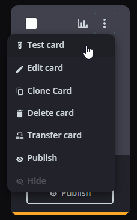
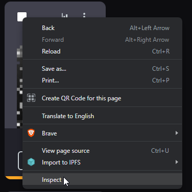
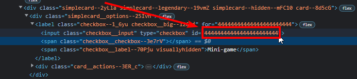

# Minecraft level counter

A little widget for OBS with data hosted on a browser, and communicating via WebRTC.

## Setup

```sh
npm install
```

## How to run

```sh
node index.js
```

## How to use

Open a browser tab on http://<server_url>:33333/
You will have a OBS url on the bottom of the page which you can set on a Browser source on OBS.

### Streamloots integration

Go to Cards & Packs managing page (https://www.streamloots.com/<you>/manage/cards), click on the menu button on any of your cards and click "Test card".



Then, click on "Open alerts url". It will open a popup with an url looking like `https://widgets.streamloots.com/alerts/<streamloots-widget-id>?bg=green`.
This `<streamloots-widget-id>` is what you need to put in the field "Streamloots widget id".

You can set card ids (separated with a `,`) which will upgrade/downgrade tools/armor levels.

To get the card ids, you will have to go Cards & Packs managing page (https://www.streamloots.com/<you>/manage/cards), then for each card you need an id for, you will have to do:

- Right click on the check box in the top-left corser of the card you want, then click "Inspect". It will open the DevTools of your browser directly on that checkbox in the HTML.


- You will need to copy the id of the card by double-clicking on the id value on the parent element in the DevTools anc pressing Ctrl+C.



- Now you can paste that id in one of the card fields.